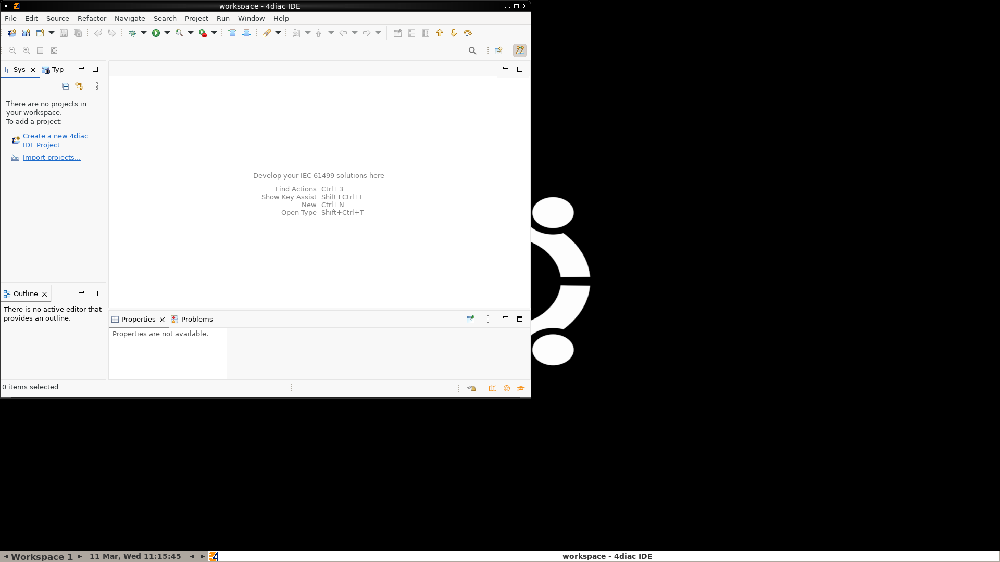
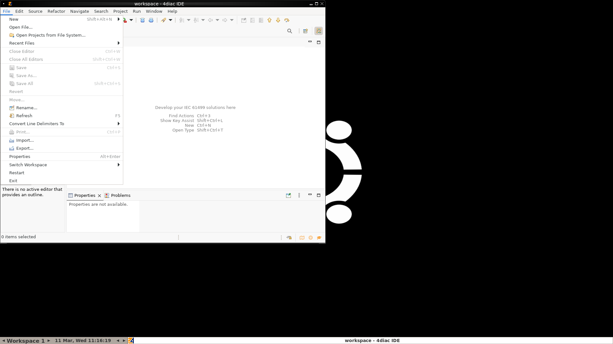
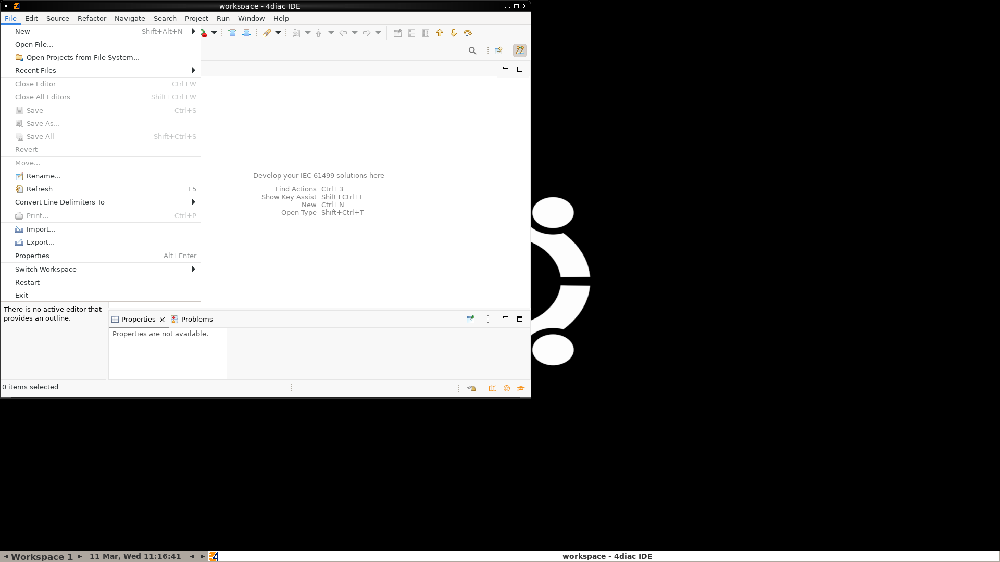
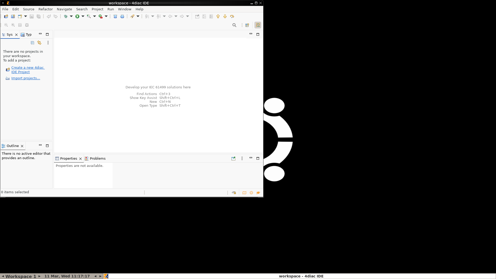
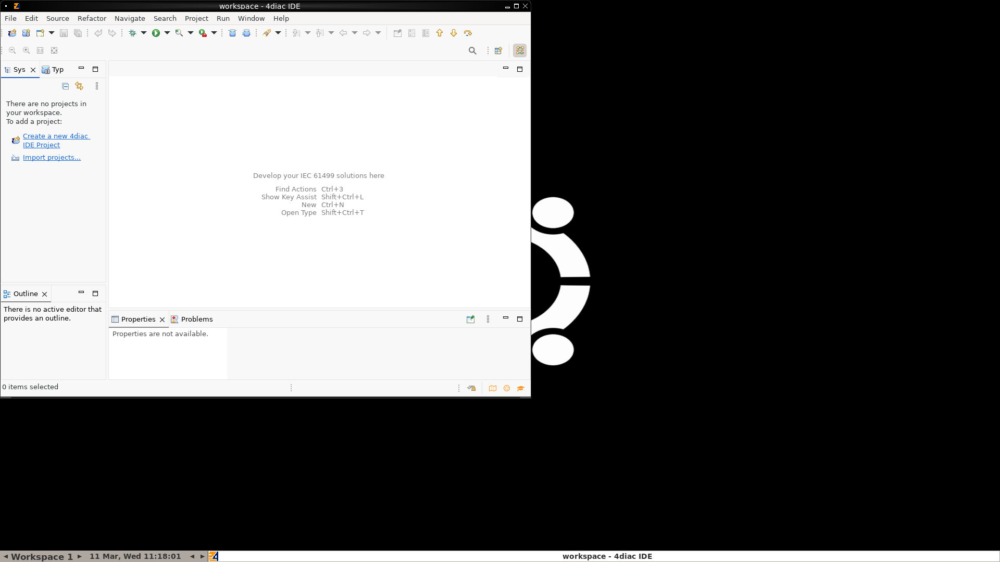

# Agent-Based UI Interaction — Experiments & Progress

**Date:** 2026-03-11
**Author:** Mirza Mir
**Context:** Phase 2 of 4diac IDE usability assessment — exploring whether AI agents can interact with the IDE directly

---

## 1. Objective

Test whether AI agents equipped with computer use capabilities (mouse, keyboard, screenshots) can:
1. Navigate the 4diac IDE
2. Perform usability assessment tasks
3. Identify usability issues through direct interaction (vs. observing video)

This complements Phase 1 (video/screenshot-based assessment) by adding an interactive component.

---

## 2. Setup Steps

### Step 1: Research Available Agents
- Surveyed 12+ AI agents capable of UI interaction
- Full research documented in `RESEARCH_UI_AGENTS.md`
- Selected **Claude Computer Use** as primary candidate (best documented API, direct Anthropic support)

### Step 2: Docker Environment
Created a Docker container running 4diac IDE with remote display access:

**Dockerfile components:**
- Base: `ubuntu:22.04`
- Java: `openjdk-17-jre` (required by 4diac IDE 3.0.2)
- Display: `Xvfb` (virtual framebuffer at 1920x1080)
- VNC: `x11vnc` on port 5900
- Web access: `noVNC` on port 6080
- Window manager: `fluxbox`
- Interaction: `xdotool` (mouse/keyboard simulation)
- Screenshot: `scrot`

**Docker Compose:**
```yaml
services:
  4diac-ide:
    build: .
    platform: linux/amd64  # Required for ARM Macs
    ports:
      - "5900:5900"   # VNC
      - "6080:6080"   # noVNC (web browser)
    environment:
      - DISPLAY=:1
      - RESOLUTION=1920x1080x24
    volumes:
      - ./workspace:/root/workspace
    shm_size: '2gb'
```

### Step 3: Verify IDE Launch

**Screenshot: 4diac IDE Welcome Screen (via VNC)**


The IDE started successfully showing the Welcome page with options:
- Create New 4diac IDE Project
- Import Existing Projects
- Clone Project from GIT Repository
- Create New 4diac IDE Example Project
- Continue to 4diac IDE

### Step 4: Manual Interaction Testing

Tested xdotool commands to verify mouse/keyboard work in Docker:

| Test | Command | Result |
|------|---------|--------|
| Focus window | `xdotool windowfocus --sync $WID` | Required for all actions |
| Click File menu | `xdotool mousemove --window $WID 10 10 && xdotool click --window $WID 1` | **Working** — File menu opened |
| Click hyperlinks | `xdotool mousemove 82 204 && xdotool click 1` | **Failed** — SWT hyperlinks don't respond |
| Keyboard shortcuts | `xdotool key --clearmodifiers ctrl+n` | **Failed** — no dialog appeared |
| Regular menus | `xdotool mousemove 15 26 && xdotool click 1` | **Working** — menus open |

**Key discovery:** `windowfocus --sync` and `windowactivate --sync` are mandatory before any xdotool action under QEMU emulation.

**Screenshot: File menu opened successfully**


The File menu shows all expected items (New, Open, Import, Export, Properties, etc.)

---

## 3. Scripts Created

### `tasks.py` — Task Definitions
Defines the 4 maintenance tasks from the Wiesmayr et al. (2023) paper:

| Task | Name | What the agent should do |
|------|------|-------------------------|
| `task1_orientation` | Orientation | Explore project structure, find function blocks |
| `task2_hierarchy` | Hierarchy Navigation | Navigate nesting levels, understand location |
| `task3_library` | Library Usage | Find and add function blocks from library |
| `task4_editing` | Editing & Type Changes | Edit blocks, change types, handle broken connections |

Also defines `SYSTEM_PROMPT` instructing the agent to act as a usability assessment expert.

### `claude_computer_use.py` — Main Agent Script
Implements the full agent loop:

1. **`take_screenshot()`** — Captures screen from Docker via `scrot`, copies to host, returns base64
2. **`_focus_window()`** — Focuses 4diac window (required for QEMU)
3. **`execute_action()`** — Translates Claude's actions to xdotool commands
4. **`run_task()`** — Main loop: screenshot → API call → execute action → repeat

**Supported actions:**
- `screenshot`, `left_click`, `right_click`, `double_click`, `triple_click`
- `left_click_drag`, `type`, `key`, `scroll`, `wait`, `cursor_position`, `mouse_move`

**API details:**
- Model: `claude-sonnet-4-6`
- Beta: `computer-use-2025-11-24`
- Tool: `computer_20251124` (display 1920x1080)
- Call: `client.beta.messages.create()`

---

## 4. Experiment: Task 1 — Orientation

### Configuration
- **Model:** Claude Sonnet 4.6 via Computer Use API
- **Max steps:** 30
- **Task:** Explore the IDE, close Welcome tab, find function blocks, navigate hierarchy
- **Starting state:** IDE open with empty workspace (no projects loaded)

### Timeline of Agent Actions

#### Phase 1: Initial Assessment (Steps 1-5)
**What happened:** Agent took a screenshot, identified the IDE layout, noted truncated tabs ("Sys", "Typ"), and tried clicking "Import projects..." link.

**Screenshot — Step 1: Initial state (empty workspace)**


**Agent's observation:**
> "The left panel shows 'Sys' and 'Typ' tabs (abbreviated — **Usability Issue #1: Tab labels are truncated**). There are no projects in the workspace."

**Usability issue found:** Tab labels "Sys" and "Typ" are not self-explanatory for new users.

#### Phase 2: Trying to Import/Create Project (Steps 6-13)
**What happened:** Agent opened File menu successfully but clicking "Import..." didn't produce a visible dialog.

**Screenshot — Step 7: File menu opened**


**Agent's observation:**
> "I can see the File menu. I'll click on 'Import...' to import an existing project."

**Screenshot — Step 11: File menu opened again (Import didn't work)**


**Agent's observation:**
> "The Import dialog didn't open either. This is a **major usability issue** — menu items that don't respond."

**Note:** This is actually a QEMU emulation limitation — SWT dialogs fail to render under QEMU. However, the agent's observation that there's no loading indicator or feedback when an action is triggered is a valid usability insight.

#### Phase 3: Alternative Approaches (Steps 14-25)
**What happened:** Agent tried multiple alternative approaches:
- Waited 2 seconds for slow dialog (Step 14)
- Tried File > New (Step 16-17)
- Tried Ctrl+N keyboard shortcut (Step 19)
- Tried clicking "Create a new 4diac IDE Project" link (Step 21)
- Tried Alt+Tab to find hidden windows (Step 24)

**Screenshot — Step 17: Menu still visible after clicking New**


**Screenshot — Step 25: Same state — no dialogs appeared**


**Agent's observation:**
> "The dialogs are not appearing. This is likely because they're opening off-screen or there's an issue with the display."

#### Phase 4: Attempting Window Management (Steps 26-30)
**What happened:** Agent tried right-clicking desktop, dragging the window, and hovering over links.

**Agent's observation:**
> "The IDE is taking up the full visible area. Let me try to resize/move the 4diac IDE window to make room for any dialogs that might be appearing."

### Task 1 Results Summary

| Metric | Value |
|--------|-------|
| Total steps | 30/30 (hit limit) |
| Actions executed | 15 clicks, 3 keyboard, 2 waits, 1 drag, 1 right-click, 8 screenshots |
| Task completed | No — blocked by QEMU dialog rendering |
| Usability issues found | 3 confirmed, 3 observed (QEMU-related but still insightful) |

### Usability Issues Identified

| # | Issue | Severity | Source | Valid? |
|---|-------|----------|--------|--------|
| 1 | Tab labels truncated ("Sys", "Typ") — not self-explanatory | Minor | Agent observation | **Yes** — real issue |
| 2 | No loading feedback when actions are triggered | Major | Agent observation | **Yes** — IDE gives no visual indicator that an action was triggered |
| 3 | Empty workspace has no onboarding guidance | Minor | Agent observation | **Yes** — new users see "no projects" with only hyperlinks |
| 4 | Hyperlinks don't respond | Critical | Agent interaction | **Partial** — QEMU issue, but links should be more prominent/reliable |
| 5 | Dialogs not visible | Critical | Agent interaction | **No** — QEMU rendering issue |
| 6 | Menu items trigger without visible result | Major | Agent interaction | **Partial** — QEMU issue, but reveals lack of feedback |

---

## 5. Earlier Run — First Attempt (Welcome Screen Present)

Before Task 1, we also ran an earlier experiment where the Welcome screen was still open. Key observations from that run:

### Agent Observations
1. **Visual proximity issue** — Agent clicked "Clone Project from GIT Repository" when trying to click "Continue to 4diac IDE" because the items are visually too close together
2. **"The chosen operation is not enabled"** — After clicking in the System Explorer, an unhelpful error dialog appeared with no explanation of what operation failed or why
3. **Welcome tab close button** — Agent had difficulty finding and clicking the small X on the Welcome tab

These observations from the first run were also valid usability findings.

---

## 6. QEMU Limitation Analysis

### The Problem
Running 4diac IDE (x86_64 Java/SWT application) on ARM Mac via Docker requires QEMU x86_64 emulation. This causes:

1. **SWT dialogs fail to open** — menu items trigger but dialog windows don't render
2. **Hyperlinks unresponsive** — SWT hyperlink widgets don't respond to xdotool clicks
3. **Keyboard shortcuts fail** — Ctrl+N, Ctrl+S etc. don't register
4. **Slow rendering** — 1-2 second delay after each action

### What Works Under QEMU
- IDE main window renders correctly
- Menu bar opens and displays items
- Mouse movement and basic clicks
- Screenshots capture correctly at 1920x1080
- VNC and noVNC access

### Solution
Run on a native x86_64 Linux machine:
- JKU university server (ask professors)
- Cloud VM (AWS EC2 c5.large, GCP e2-medium)
- Any x86_64 Linux desktop

---

## 7. Conclusions

### What We Proved
1. **The approach works** — Claude Computer Use can see the IDE, reason about UI elements, plan actions, and execute them
2. **Agent finds real usability issues** — even with limited interaction, it identified tab labeling, missing feedback, and onboarding gaps
3. **The agent loop is functional** — screenshot → reasoning → action → repeat works end-to-end
4. **Docker + VNC setup is solid** — 4diac IDE runs, VNC works, screenshots are clean

### What We Need
1. **Native x86_64 machine** — to eliminate QEMU issues and enable full dialog interaction
2. **A project loaded in the workspace** — so the agent can explore hierarchy, library, editing
3. **Comparison framework** — how to systematically compare agent findings vs video findings vs human findings

### Comparison: Three Assessment Approaches

| Aspect | Video (Gemini) | Screenshots (multi-model) | Agent (Claude CU) |
|--------|---------------|--------------------------|-------------------|
| Issues found | ~8/10 | ~3-5/10 | ~3/10 (limited by QEMU) |
| Interaction depth | Observes workflows | Static snapshots | Actually uses the tool |
| Cost | Low (1 API call) | Low (1 API call) | High (30+ API calls) |
| Time | ~30 seconds | ~10 seconds | ~3 minutes |
| Unique insights | Workflow timing, transitions | Layout, visual design | Interaction bugs, missing feedback |
| Limitation | Can't try alternatives | No dynamics | Needs native machine |

### The Key Insight
Each approach finds **different kinds of issues**:
- **Video** catches workflow-level problems (too many steps, broken connections)
- **Screenshots** catch visual design problems (small icons, cluttered layout)
- **Agent** catches interaction-level problems (missing feedback, unresponsive elements, confusing onboarding)

**The ideal assessment combines all three.**

---

## 8. File Inventory

```
agent_interaction/
├── RESEARCH_UI_AGENTS.md      # Survey of 12+ UI interaction agents
├── EXPERIMENTS.md              # THIS FILE
├── docker-compose.yml          # Docker Compose config
├── Dockerfile                  # Container build (Ubuntu + Java + 4diac + VNC)
├── start.sh                    # Container entrypoint script
├── tasks.py                    # 4 task definitions + system prompt
├── claude_computer_use.py      # Main agent script
├── workspace/                  # Mounted into Docker as /root/workspace
├── screen_check.png            # Initial verification screenshot (Welcome screen)
├── screen_focus.png            # File menu opened (after windowfocus fix)
├── screen_after_click.png      # Click attempt on welcome screen
├── screen_maximized.png        # After maximize attempt
└── outputs/
    ├── task1_orientation_report.md      # Agent's usability report
    ├── task1_orientation_results.json   # Full results with action log
    └── task1_orientation_step01-30.png  # Screenshot at every step (30 total)
```

---

## 9. Next Steps

1. **Get x86_64 Linux access** — ask JKU for server or spin up cloud VM
2. **Load example project** — create/import a project so agent has content to explore
3. **Run all 4 tasks** — full experiment with 30 steps each
4. **Try additional agents** — Simular Agent S (72.6% OSWorld), OpenAI CUA
5. **Build comparison matrix** — agent vs video vs human for all 10 ground truth issues

---

*Last updated: 2026-03-11*
