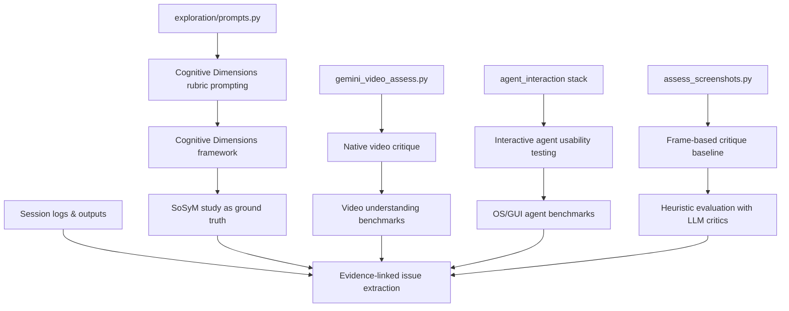

# LLM and Agent-Assisted Usability Assessment from Video, Screenshots, and Session Logs: Literature Review Grounded in the 4diac Case Study and SoSyM 2023

## Executive summary

This report analyzes the practical pipeline implemented in the 4diac repository and connects it to the fastest-growing research threads in LLM/agent-assisted usability evaluation: (i) **LLM “critic” workflows for UI/UX assessment**, (ii) **multimodal review of screen recordings + step logs**, and (iii) **interactive GUI agents that operate apps to surface issues and enable regression-style evaluation**. citeturn24view0turn26view0turn29view0turn29view1turn29view3

In the repository’s own evaluation, **native video understanding** (Gemini + video) achieves the highest alignment with the SoSyM paper’s “ground truth” top-10 issues (≈8/10), while screenshot-based variants degrade substantially (≈4/10, 3/10, 2/10 depending on model). citeturn26view0 This result is consistent with the broader benchmark trend that **temporal context matters** for instruction-following and long-horizon UI tasks, and that purely static inputs often miss “process” cues (intent → action → feedback), which are central to usability. citeturn17search14turn17search6turn20search2

Methodologically, the SoSyM 2023 study provides a strong grounding point because it explicitly combines a **Cognitive Dimensions of Notations (CD)** walkthrough with a **user study (10 industrial automation engineers)** and later tool improvements + reassessment with engineers from multiple enterprises. citeturn32view3 The repo operationalizes this structure by turning CD into a prompt rubric, and by translating the paper’s four maintenance tasks into agent-executable task definitions. citeturn29view2turn28view0turn26view0

Across the 2023–2026 literature, the closest “analogues” to your pipeline are: **LLM-based heuristic evaluation for designs** (UI mockups critique + datasets), **simulated usability testing with LLM agents producing action traces + video replay**, and **OS/GUI agent benchmarks** that formalize evaluation pitfalls such as environment drift, starting-state sensitivity, grounding errors, and over-optimistic scoring. citeturn20search3turn27search0turn20search0turn20search1turn17search0turn19search1turn17search3turn18search3

## Scope and research questions

The scope is **LLM/agent-supported usability assessment** for complex, notation-heavy tools (here: an industrial automation IDE), emphasizing:

- **Inputs**: screen recordings (video), extracted frames, screenshots, and full session logs (step-by-step traces).
- **Processing**: rubric-based critique (Cognitive Dimensions, heuristic evaluation), multimodal summarization, and agent-based exploratory QA.
- **Outputs**: issue lists, severities, evidence links (timestamps/frames), and action-oriented improvement recommendations suitable for iterative product work.

This report answers seven research questions that map directly to your practical pipeline:

1. How do the repository artifacts implement a reproducible, multi-modal usability assessment workflow (video vs screenshots vs agent interaction), and what research themes each artifact maps to? citeturn24view0turn26view0turn29view0turn29view1turn29view3turn28view0  
2. How does the SoSyM 2023 study structure “ground truth,” task design, and CD-based evaluation, and how does that inform an LLM/agent evaluation methodology? citeturn32view3turn26view0  
3. What 2023–2026 literature most closely matches: (a) LLM heuristic evaluation, (b) multimodal UX summarization, (c) simulated usability testing agents, (d) OS/GUI agent benchmarks, and (e) agent evaluation pitfalls? citeturn20search3turn27search0turn20search0turn20search1turn17search0turn18search0turn19search1turn17search3  
4. What experiments/metrics/datasets are used to evaluate these systems, and which failure modes are repeatedly observed? citeturn17search0turn18search2turn18search1turn18search32turn19search1turn18search3turn17search3  
5. What gaps and opportunities are revealed by comparing the repo findings (video ≫ frames; environment confounds; grounding limits; reproducibility) with benchmark findings? citeturn26view0turn12view4turn17search3turn19search1turn18search3  
6. Which additional models/pipelines should be evaluated next (closed and open multimodal models), and what evaluation protocols are most defensible for a seminar + future experiments? citeturn23search4turn23search3turn22search0turn21search1turn21search2  
7. What concrete, prioritized reading list should underpin a seminar literature review tied to this practical work?

## Methodology and reproducible search protocol

Repository analysis was performed by reading the project’s README, meeting summary, full session log, core scripts for video and screenshot assessment, and the agent interaction stack (Docker environment +任务 definitions + xdotool action execution loop). citeturn24view0turn26view0turn12view4turn29view0turn29view1turn28view0turn14view0turn15view0turn16view1turn29view3 The SoSyM 2023 article was incorporated using the accessible preview text that explicitly states the CD walkthrough, the 10-engineer user study design, and the reassessment framing. citeturn32view3 The Cognitive Dimensions framework was grounded via a public PDF from the authors’ academic site (the framework is explicitly positioned as discussion tools rather than a fixed analytic method, and it emphasizes trade-offs). citeturn31search2

The literature exploration was structured as a triangulation across: entity["organization","arXiv","preprint repository"] (for primary technical reports), entity["organization","OpenReview","peer review platform"] (for ICLR/NeurIPS-style publications and PDFs), entity["organization","ACM","computing association"] Digital Library (HCI/UIST/CHI papers), and entity["organization","ACL Anthology","nlp paper repository"] (web agent and multimodal agent evaluations). Sources were prioritized when an official paper PDF, project page, or dataset repository exists. citeturn17search0turn17search9turn20search7turn18search20

Reproducible (copy/paste) scholar-style queries (set year filter to **2023–2026**, sort by relevance, then by date; also try “include patents = off”):

```text
"large language model" heuristic evaluation UI mockup 2023..2026
LLM "usability testing" simulated users "action trace" video replay 2023..2026
"multimodal" UX testing summarization think-aloud interaction logs 2023..2026
"GUI agent" benchmark OSWorld WindowsAgentArena WorldGUI 2023..2026
"web agent" benchmark WebArena VisualWebArena VideoWebArena 2023..2026
"grounding" "set-of-mark" web agent SeeAct Mind2Web 2023..2026
"illusion of progress" web agents Online-Mind2Web 2023..2026
"screen understanding" vision-language model ScreenAI 2023..2026
"computer-using agent" dataset GUI-360 UI-Vision OmniACT 2023..2026
```

To specifically mirror your repo’s pipeline (video→issues, screenshots→issues, agent→issues), add query variants:

```text
"video understanding" usability evaluation IDE screen recording
LLM critique "timestamps" "screen recording" usability issues
agent-based QA "desktop" xdotool VNC "computer use" evaluation
```

## Repository artifact-to-theme mapping

The repo implements a clear two-phase research scaffold: **Passive observation** (video/screenshot critique) plus **Interactive assessment** (agent operates the IDE). citeturn24view0 Below is a precise mapping from artifacts you identified to research themes and methodological roles.

**Core project framing and reproducibility**

- **README.md** defines the two approaches (passive analysis vs interactive assessment), positions the SoSyM study as ground truth, and reports the headline result that Gemini+video detects ≈80% of known issues from a single video. citeturn24view0turn26view0  
- **FULL_SESSION_LOG.md** functions as a “lab notebook”: it records the end-to-end build/run commands, frame extraction, observed limitations (notably QEMU/SWT issues), and a structured chronological index of topics. citeturn12view2turn12view4  
- **SUMMARY_FOR_MEETING.md** provides the evaluation centerpiece: the “issue detection matrix” comparing model+modality configurations against the paper’s top-10 issues (with frequency counts). It also contains CD dimension comparisons and explicit limitations (e.g., “video is essential”). citeturn26view0  

**Passive video critique (native video understanding)**

- **exploration/prompts.py** implements rubric engineering as a research instrument: a *blind* prompt, a *CD-guided* prompt (explicitly enumerating dimensions like viscosity, visibility, premature commitment), and task-oriented prompts. This maps to the research theme “LLM as evaluator under explicit theory-driven rubric.” citeturn29view2turn13view4  
- **exploration/gemini_video_assess.py** operationalizes video-based evaluation using the modern Google GenAI SDK, uploads video files, waits for processing, and runs different prompt variants (blind/CD/task). This maps to multimodal evaluation pipelines that preserve temporal interaction cues. citeturn29view0  
- **Interpretation**: your repo’s strongest result (≈8/10 issue detection) is explicitly tied to *video as first-class input* and to prompting that asks for evidence (+ timestamps). citeturn12view1turn26view0  

**Screenshot/frame critique (cross-model fairness baseline)**

- **exploration/assess_screenshots.py** builds a matched comparison across vendors by forcing screenshots into all models, defining frame sets (6 frames and 20 frames), and invoking separate client stacks (OpenAI, Google, Anthropic). This maps to “controlled modality ablation studies” (video vs frames) and reproduces the common finding that temporal sequencing is a major confound in UI reasoning. citeturn29view1turn13view2turn11view2  
- In the project summary, screenshot approaches score substantially lower against the ground truth matrix (≈4/10 for Gemini screenshots, ≈3/10 for Claude screenshots, ≈2/10 for GPT-4o screenshots). citeturn26view0  

**Interactive agent assessment (agent operates software)**

- **agent_interaction/Dockerfile**, **docker-compose.yml**, and **start.sh** together establish a reproducible GUI sandbox: Ubuntu + Java + 4diac IDE, virtual display (Xvfb), window manager (fluxbox), and remote viewing via VNC/noVNC. This maps to the research theme “containerized evaluation environments for GUI agents.” citeturn14view0turn15view0turn16view1  
- **agent_interaction/tasks.py** translates the SoSyM study tasks into explicit agent prompts and defines a system prompt that forces: screenshot-first behavior, severity ratings, and evidence-driven reporting. This maps to “task-based usability testing protocols” and aligns with benchmark practice (task success + step budget). citeturn28view0  
- **agent_interaction/claude_computer_use.py** implements the low-level action loop: take screenshot (via scrot), focus window, execute xdotool actions (click/type/scroll/drag), and handle slow execution contexts (explicit delays, focus management). This maps to “agent environment + actuator reliability” as a major validity threat. citeturn29view3turn11view4  
- **agent_interaction/EXPERIMENTS.md** documents an orientation task run (30 steps), provides agent action breakdown, and highlights QEMU-related confounds (dialogs not appearing, hyperlinks unresponsive). Importantly, it also records **usability issues the agent flags that are plausibly real** (e.g., truncated labels, lack of feedback) vs issues that are likely virtualization artifacts. citeturn16view3turn12view4  

**Entity-relationship view (repo ↔ methods ↔ literature anchors)**



The repo’s structure mirrors an emerging “quad” in current research: **(rubric prompting) + (multimodal evidence) + (interactive agents) + (benchmark-style evaluation)**. citeturn26view0turn20search0turn20search1turn17search0turn17search3

## Foundations from the SoSyM paper and Cognitive Dimensions

### What the SoSyM study contributes methodologically

The SoSyM 2023 article (doi:10.1007/s10270-023-01084-7) is directly aligned with your thesis topic because it provides three crucial components of “ground truth” methodology:

1. A **walkthrough guided by the Cognitive Dimensions of Notations framework** (CD) to assess the IDE’s demonstrated capabilities. citeturn32view3  
2. A **user study with ten industrial automation engineers** performing realistic control software maintenance tasks in the IDE. citeturn32view3  
3. A **tool improvement + reassessment** framing (reassessment with engineers from seven industrial enterprises), which supports “before/after” iteration narratives typical of usability engineering. citeturn32view3  

Your repo uses the paper exactly in the most defensible way a practical project can: it extracts a top-10 issue list (with frequencies), turns the four maintenance tasks into explicit task prompts, and then evaluates LLM/agent methods by “hit rate” on those issues. citeturn26view0turn28view0turn24view0

### Why Cognitive Dimensions is a strong rubric for LLM-based evaluation

Cognitive Dimensions is particularly appropriate for IDEs and notation-heavy tooling: it was designed to give a structured vocabulary for discussing cognitive costs and trade-offs of notational systems, explicitly emphasizing that it is **a discussion tool rather than a rigid analytic method**. citeturn31search2 This matters for LLM-based evaluation because:

- LLM outputs can otherwise become a flat “list of suggestions.” CD forces coverage across dimensions (e.g., viscosity, hidden dependencies) that map well to IDE maintenance tasks. citeturn29view2turn13view4  
- CD’s trade-off framing helps mitigate a common LLM failure mode: recommending generic feature additions without acknowledging that fixing one difficulty can create another. citeturn31search2turn26view0  

The repo’s own ablation supports this: CD-guided prompting yields the most structured, compareable output across runs, and the meeting summary explicitly notes that Gemini video CD ratings were evidence-based (whereas screenshot-based critiques tended toward generic or overly harsh judgments). citeturn12view1turn26view0

image_group{"layout":"carousel","aspect_ratio":"16:9","query":["Cognitive Dimensions of Notations framework diagram","Cognitive Dimensions of Notations viscosity visibility premature commitment diagram","Cognitive Dimensions framework trade-offs diagram"] ,"num_per_query":1}

## Related literature and benchmark landscape

This section is organized around the *closest research neighbors* to your pipeline: LLM critics for UI evaluation, simulated usability testing agents with video replay + logs, multimodal UX summarization, and GUI agent benchmarks focusing on reliability and evaluation validity.

### Candidate papers and systems

**Table A — Candidate papers (prioritized for similarity to your repo)**  
Relevance score: **5** = extremely close to your pipeline; **1** = peripheral but useful as supporting context.

| Title | Year | Venue | Short summary | Relevance (1–5) | Why relevant to your repo |
|---|---:|---|---|---:|---|
| Assessing the usefulness of a visual programming IDE for large-scale automation software | 2023 | SoSyM | Walkthrough with Cognitive Dimensions → user study (10 automation engineers) → tool improvement → reassessment with engineers from multiple enterprises. citeturn32view3 | 5 | Provides *ground truth issues*, task framing, and CD as methodology; your repo implements an automated analogue of these phases. citeturn26view0 |
| The Cognitive Dimensions of Notations framework (chapter PDF) | 2003 (widely used in later work) | Book chapter (public PDF) | Defines CD as discussion tools; emphasizes trade-offs; widely used for analyzing notational systems. citeturn31search2 | 5 | Your prompting strategy is a direct operationalization of CD into a rubric for LLM evaluation. citeturn29view2 |
| Generating Automatic Feedback on UI Mockups with Large Language Models | 2024 | CHI | LLM-driven heuristic evaluation for UI mockups; evaluated on many UIs and compared to expert feedback. citeturn20search3turn20search7 | 4 | Closest “LLM as heuristic evaluator” analogue; informs how to judge usefulness/novelty over iterations (a failure mode you also observe). citeturn26view0 |
| UICrit: Enhancing Automated Design Evaluation with a UI Critique Dataset | 2024 | UIST | Builds a critique dataset (3,059 critiques; 983 mobile UIs) and improves LLM-generated feedback via prompting/few-shot strategies. citeturn27search0turn27search4 | 4 | Provides an evidence-based path from “LLM critique exists” → “LLM critique can be *trained/conditioned* to be more reliable.” |
| LLM-powered Multimodal Insight Summarization for UX Testing | 2024 | ACM | Uses LLMs to generate insights from multimodal UX testing data, connecting what users did with what they said. citeturn20search2turn20search6 | 5 | Directly aligned with your “full session logs + video examination” goal: evidence-based summarization of user behavior. |
| UXAgent: A System for Simulating Usability Testing of Web Design with LLM Agents | 2025 | arXiv / industry paper | Simulates usability testing with persona generator + LLM agents; presents qualitative/quantitative logs and includes an Agent Interview + Video Replay interface. citeturn20search0turn20search38 | 5 | Nearly isomorphic conceptually: your repo’s Phase 2 resembles “simulated users” (agents), and Phase 1 resembles “video replay review.” citeturn26view0turn16view3 |
| UXCascade: Scalable Usability Testing with Simulated User Agents | 2026 | arXiv | Multi-level analysis workflow to aggregate agent-generated feedback across personas, link reasoning to issues, and support iterative improvements. citeturn20search1 | 5 | Offers analysis scaffolding for turning many agent traces into actionable UX interventions—exactly the “feature improvement workflow” you want to justify. |
| WebArena: A Realistic Web Environment for Building Autonomous Agents | 2023 | arXiv | Realistic, self-hosted web environments with execution-based evaluation; reports low agent success vs humans on long-horizon tasks. citeturn18search2turn18search26 | 4 | Core reference for reproducible interactive evaluation and validity threats in agent benchmarks; useful template for your agent-based IDE tasks. |
| VisualWebArena | 2024 | ACL | Extends web agent evaluation to visually grounded tasks (≈910); highlights gaps of text-only agents and remaining multimodal limits. citeturn17search9turn17search5 | 4 | Closely matches screenshot-grounded interactions and “UI grounding” problems (what element to click). |
| VideoWebArena | 2025 | ICLR | Benchmark for long-context video understanding in web tasks; includes large numbers of tasks spanning “skill retention” and “factual retention.” citeturn17search14turn17search6 | 5 | Strongest benchmark analogue for your video-based evaluation finding: temporal context and long context materially change performance. |
| OSWorld | 2024 | NeurIPS (benchmark track) | 369 real OS tasks in real computer environments; provides standardized setup and execution-based evaluation scripts. citeturn17search0turn17search4 | 5 | Closest “desktop agent benchmarking” frame for your Phase 2; emphasizes replicability and OS-level workflows. |
| Windows Agent Arena | 2024–2025 | arXiv / PMLR | Windows-only benchmark, 154 tasks; reports best success ≈19.5% vs human ≈74.5%, emphasizing scalable evaluation. citeturn18search0turn18search32turn18search20 | 4 | Highlights that OS-level agents remain far below human reliability and that evaluation must control huge confounds—relevant to your QEMU issues. citeturn12view4turn16view3 |
| AndroidWorld | 2024–2025 | arXiv / ICLR | Dynamic benchmark with 116 tasks across 20 real apps; shows best agent ≈30.6% and emphasizes robustness to variations. citeturn18search1turn18search9 | 3 | Useful for the “dynamic tasks + reproducibility” methodology; less directly tied to desktop IDE but aligns with evaluation design. |
| WorldGUI | 2025 | arXiv | Tests desktop GUI automation “from any starting point”; explicitly targets planning sensitivity to initial state. citeturn17search3turn17search7 | 5 | Mirrors your biggest Phase 2 validity threat: environment state (QEMU slowness/dialog failures) can dominate outcomes. citeturn12view4 |
| SeeAct (GPT‑4V is a generalist web agent, if grounded) | 2024 | arXiv | Demonstrates that performance can be high under “oracle grounding,” but grounding remains the bottleneck; also introduces online evaluation. citeturn18search3turn18search7 | 5 | Supports a key claim you can make rigorously: “analysis is limited less by reasoning and more by grounding/interaction mapping.” |
| Mind2Web | 2023 | arXiv / OpenReview | 2,000+ real web tasks across many websites; introduces generalist web agent evaluation challenges. citeturn19search0turn19search8 | 3 | Methodologically useful precedent for “task collection from real interfaces” and “agent traces as data.” |
| An Illusion of Progress? Assessing the Current State of Web Agents (Online‑Mind2Web) | 2025 | arXiv | Critiques over-optimistic results; introduces Online‑Mind2Web and an LLM-as-judge that reaches ≈85% agreement with humans. citeturn19search1turn19search9 | 5 | Provides an academically credible “evaluation validity” lens for your seminar: why naive metrics can mislead and why judge design matters. |
| WebCanvas / Mind2Web-Live | 2024 | arXiv / ICML | Online evaluation framework; Mind2Web-Live dataset and metrics such as “Efficiency Score.” citeturn19search2turn19search10 | 4 | Directly informs how to move beyond “task success only” toward efficiency/step-normalized metrics for agents. |
| OmniACT | 2024 | ECCV | Desktop+web dataset for generating executable programs from screen + task; baseline gap to humans is large. citeturn21search3turn21search7 | 4 | Strong supporting reference that “desktop automation from screen input remains hard,” reinforcing why IDE evaluation needs careful protocols. |
| UFO | 2024–2025 | arXiv / NAACL | UI-focused Windows OS agent using multimodal models + action grounding; evaluated across multiple apps. citeturn22search0turn22search20 | 4 | Useful “task decomposition + grounding module” architecture you can compare to your xdotool-based pipeline. |
| ScreenAI | 2024 | arXiv / IJCAI | UI- and infographic-specialized vision-language model; includes screen annotation tasks and UI element localization; releases datasets. citeturn27search2turn27search38 | 4 | Highly relevant as a *specialized perception backbone* for improving screenshot parsing and grounding in IDE contexts. |
| GUI‑360 | 2025 | arXiv | Large dataset/benchmark with millions of action steps; evaluates grounding, screen parsing, and action prediction. citeturn27search3turn27search7turn27search27 | 4 | Provides a strong benchmark argument for why you should separate “grounding quality” from “planning quality” in your evaluations. |

### Benchmarks and model families to reference (with modality and metrics)

**Table B — Benchmarks/datasets and model families relevant to your evaluation design**

| Name | Modality | Typical task type | Key metrics highlighted in papers | Public reference |
|---|---|---|---|---|
| OSWorld | Screen + actions (OS-level) | Real desktop workflows across OS/apps | Task success rate; execution-based evaluation with scripts; reproducible setups. citeturn17search0turn17search4 | citeturn17search12 |
| Windows Agent Arena | Screen + actions (Windows) | 154 multi-step Windows tasks | Success rate; emphasizes scalable evaluation; reports human vs best-agent gap. citeturn18search32turn18search16 | citeturn18search16turn18search8 |
| WorldGUI | Screen + actions (desktop apps) | Tasks from varied starting states (“any starting point”) | Success rate under initial-state variation; measures planning robustness. citeturn17search3turn17search7 | citeturn17search19 |
| WebArena | Web UI (self-hosted) | Long-horizon web tasks with execution checking | End-to-end success; human vs agent comparisons; execution-based evaluation. citeturn18search2turn18search26 | citeturn18search10 |
| VisualWebArena | Web UI + visuals | Visually grounded web tasks (≈910) | Task success; visual grounding error analysis; compares multimodal vs text-only. citeturn17search5turn17search9 | citeturn17search29 |
| VideoWebArena | Video + web actions | Tutorial/video-informed web tasks (2,000+ scale) | Factual + skill retention; long-context video understanding. citeturn17search14turn17search6 | citeturn17search18 |
| Mind2Web | Web UI (HTML + screenshots in many setups) | Generalist web tasks across many websites | Task success; generalization across domains; highlights context-window constraints. citeturn19search0turn19search8 | citeturn19search16 |
| Online‑Mind2Web | Live web | Online evaluation that approximates real user use | Introduces online benchmark; LLM-as-judge with ≈85% agreement with humans. citeturn19search1turn19search9 | citeturn19search28 |
| WebCanvas / Mind2Web‑Live | Live web + intermediate nodes | Online agent evaluation with intermediate states | Step-based progress; introduces “Efficiency Score.” citeturn19search2turn19search10 | citeturn19search10 |
| OmniACT | Desktop + web (script generation) | Generate executable programs from screen + instruction | Measures gap vs human proficiency; program synthesis/execution validity. citeturn21search3turn21search7 | citeturn21search11 |
| GUI‑360 | Desktop apps (large-scale logging) | Grounding + screen parsing + action prediction | Benchmarks separate perception from action prediction. citeturn27search3turn27search27 | citeturn27search27 |
| Gemini API (video understanding) | Video + multimodal | Upload video and query for content understanding | Enables native video prompting; supports “video-first” workflows. citeturn23search3 | citeturn23search11 |
| GPT‑4o (vision) | Images + text | Screenshot-based reasoning | Officially supports text+image inputs; no native “video understanding” described in model page. citeturn23search4 | citeturn23search0 |
| Claude computer use tool | Screenshots + tool actions | Interactive desktop control with tool-use loop | Documented “computer use tool” flow and constraints; screenshot-dependent. citeturn23search2turn23search35 | citeturn23search2 |
| Qwen2.5‑VL | Image/video-capable VLM (open) | Screen understanding, document parsing, long video | Strong open VLM baseline; claims robust spatial/temporal localization in report. citeturn21search1turn21search5 | citeturn21search1 |
| InternVL 2.5 | Image VLM (open) | Multimodal reasoning/understanding | Competitive open model family; useful for open-source baselines. citeturn21search2turn21search10 | citeturn21search2 |
| LLaVA | Image VLM (open) | General visual instruction following | Classic open multimodal baseline; useful for ablations. citeturn21search0 | citeturn21search0 |
| ScreenAI | UI-specialized VLM | UI element recognition + screen-to-text representations | Tailored for UI/infographic understanding; releases datasets. citeturn27search2turn27search38 | citeturn27search2 |

### How these strands connect back to your repo’s contributions

Your repo can be positioned as an **industrial-IDE case study** of a broader pattern:

- “LLM as evaluator” exists (CHI/UIST critique papers), but your repo adds a **video-first, evidence-linked** stance and measures *hit-rate against an external usability ground truth* rather than subjective “is feedback helpful.” citeturn20search3turn27search0turn26view0  
- “Simulated usability testing” systems (UXAgent/UXCascade) are explicitly building dashboards for action traces, interviews, and video replay—conceptually identical to your combination of session logs + screenshot steps + summarization outputs, but currently focused on web interfaces. citeturn20search0turn20search1turn26view0turn16view3  
- GUI agent benchmarks emphasize that **evaluation validity** and **environment setup** dominate measured performance. Your QEMU/SWT confounds are a concrete example of the same issue WorldGUI targets: “starting point” and runtime state can overwhelm planning quality. citeturn12view4turn17search3turn17search7  

## Failure modes, metrics, and evaluation design patterns

### Failure modes repeatedly observed in the literature—and already visible in your logs

**Video vs frames as an information bottleneck**  
Your results show a large drop from “Gemini video ≈8/10 issues” to screenshot-based variants. citeturn26view0 This aligns with VideoWebArena’s explicit claim that many agent benchmarks ignore long-context video understanding, and with its motivation that videos often supply information unavailable in static imagery. citeturn17search10turn17search14 Practically, usability issues are frequently about *interaction sequences* (what did the user try, what feedback occurred next), which a frame set can under-sample.

**Grounding and action mapping** (what to click / where)  
SeeAct’s central result is that performance can look strong under “oracle grounding,” but grounding remains a key unsolved bottleneck; set-of-mark style prompting alone is insufficient, and best strategies combine structure (HTML) + visuals. citeturn18search3turn18search7 Your Phase 2 agent stack shows the desktop analogue: even if the model “knows” what it wants, actuation must reliably land on the correct UI objects, which becomes fragile under emulation and focus issues. citeturn29view3turn12view4

**Initial state sensitivity / environment validity threats**  
WorldGUI is explicitly motivated by the observation that slight initial-state differences (app not open, non-default views) lead to planning errors and are under-tested; it creates task variations to test this. citeturn17search3turn17search7 Your Docker-on-ARM scenario is an extreme instance: QEMU + SWT causes dialogs not to render, hyperlinks not to click, and shortcuts to fail, which makes a “failed task” ambiguous (agent weakness vs environment artifact). citeturn12view4turn16view3

**Over-optimistic evaluation and “score inflation”**  
Online‑Mind2Web explicitly argues that many reported agent gains are over-optimistic due to benchmark shortcomings, and proposes online evaluation plus LLM-as-judge scoring that reaches ≈85% agreement with humans. citeturn19search1turn19search9 This directly motivates a best practice for your future experiments: whenever you add “AI as judge” for usability reports, quantify its agreement with human raters on a subset.

**Generic critiques / hallucinated “missing features”**  
Your meeting summary reports that some screenshot-based critiques are generic and can suggest features that already exist, and that some models may be “over-critical without specific evidence.” citeturn26view0 This pattern matches what CHI/UIST critique papers report: LLM feedback can be useful but imperfect; usefulness can decrease over iterations, and critique needs grounding. citeturn20search3turn27search0

### Metrics that are most defensible for your seminar + future experiments

Based on your repo’s matrices and the benchmark literature, the most defensible metric stack is:

**Ground-truth aligned issue retrieval (core)**  
Use the SoSyM top-10 issues as a labeled target list and compute:
- Issue recall@10 (how many of the 10 are found),
- Partial-credit scoring with explicit criteria (your matrix already uses “YES/partial/no”), and
- Evidence quality (timestamp/frame ID + UI element naming), because evidence is the bridge from critique to actionable engineering work. citeturn26view0turn12view1

**Cost/time and efficiency (secondary, but powerful)**  
Benchmarks increasingly complement success with efficiency metrics (e.g., WebCanvas “Efficiency Score” that normalizes steps to progress). citeturn19search10turn19search6 For your pipeline:
- Wall-clock time per assessment,
- Token/cost estimates (if available),
- Steps-to-issue ratio (issues found per N steps / per minute),
- For agent runs: success rate under fixed step budget (OSWorld/WindowsAgentArena-style). citeturn17search0turn18search32turn16view3

**Robustness under task and state variations (validity)**  
Borrow WorldGUI’s insight explicitly: run tasks under multiple starting states (IDE with welcome tab open; empty workspace; project loaded; deep hierarchy already expanded; etc.), and report variance. citeturn17search3turn17search7turn16view3

## Research gaps and actionable recommendations tied to your repo

### Gaps your repo surfaces that are under-addressed in the open literature

**IDE-specific usability evaluation is under-benchmarked relative to web/OS agents**  
Benchmarks like WebArena, VisualWebArena, and OSWorld focus on general web/desktop tasks rather than domain-heavy IDE workflows; your case study fills a niche by anchoring evaluation to a real industrial automation IDE and a published usability study. citeturn17search0turn18search2turn32view3turn26view0 A strong seminar claim is: *industrial IDEs are an under-explored target domain for multimodal agent usability evaluation, despite being high-impact.* citeturn32view3turn24view0

**Video-first usability assessment has few “ground truth” datasets**  
VideoWebArena benchmarks video understanding for web tasks, but not “usability issue discovery.” citeturn17search10turn17search14 Your repo effectively creates a proto-dataset: demo video + labeled issue list + prompts + outputs. A clear future contribution is to publish an *annotated evidence map*: issue → timestamps → frames → UI region (bounding box), similar in spirit to UICrit’s critique+bbox dataset for mobile UIs. citeturn27search0turn26view0

**Agent environment validity needs formal treatment in usability studies**  
Your Phase 2 highlights that emulation artifacts can masquerade as usability issues (“dialogs not appearing”), while still surfacing real usability properties (“no feedback when menu action triggered”). citeturn16view3turn12view4 WorldGUI’s motivation provides a literature-backed framing: reliable evaluation must explicitly test and report initial state and system dynamics. citeturn17search7turn17search3

### Recommended additional models and evaluation protocols

**Model selection rationale grounded in official capability statements**

- For video-based critique, use Gemini because it has explicit official developer support for video understanding via uploaded video inputs. citeturn23search3  
- For screenshot-based critique with OpenAI models, the GPT‑4o model page explicitly describes text+image input and text output; it does not describe native video understanding in the model description, which supports your repo’s “frames required” design. citeturn23search4turn29view1  
- For interactive agents, Claude’s documented computer use tool formalizes the system prompt / tool loop approach and is consistent with your agent_interaction implementation pattern (screenshots + actions). citeturn23search2turn29view3  

**Open-model baselines for reproducibility and ablations**

You can strengthen academic rigor by adding at least one open model baseline for screenshots/frames (and potentially short video segments), such as:
- Qwen2.5‑VL (explicitly emphasizes spatial localization and long-video comprehension in its technical report). citeturn21search1turn21search5  
- InternVL 2.5 (open multimodal model family with broad benchmark reporting). citeturn21search2turn21search10  
- LLaVA (classic image-instruction baseline; useful as a “lower bound”). citeturn21search0  
To improve perception/grounding specifically, ScreenAI is directly targeted at UI understanding and provides a principled screen-annotation approach. citeturn27search2turn27search38  

**Evaluation protocol upgrades (what to add beyond the current repo)**

1) **Two-layer ground truth**  
Keep the SoSyM top-10 list as “primary ground truth,” but also maintain a “secondary validated issues” list that your AI models found and that a human expert confirms (your meeting summary already lists additional issues). citeturn26view0turn25view0 This mirrors the “critic + iteration” logic in UXAgent/UXCascade, where agent output is not treated as ground truth but as candidate evidence for human review. citeturn20search0turn20search1  

2) **Traceable evidence requirements**  
Require every reported issue to include: (a) timestamp or frame ID, (b) UI element name/location, (c) observed outcome, (d) expected outcome. Your repo already notes that Gemini video cites timestamps and that evidence quality affects usefulness; formalizing this aligns with benchmark practice. citeturn12view1turn26view0turn18search2  

3) **Judge design with measured agreement**  
If you use an LLM as a judge for whether an issue matches the ground truth, follow Online‑Mind2Web’s posture: quantify agreement with human judgments on a sampled set and report judge failure cases. citeturn19search1turn19search9  

4) **State-variation suite**  
Borrow WorldGUI’s “any starting point” philosophy: run agent + critique under multiple preconditions (workspace empty vs project loaded; welcome tab visible; zoom level changed; hierarchy expanded/collapsed). Report performance distribution, not only mean. citeturn17search3turn17search7turn16view3  

### Recommended evaluation pipeline (replicable and publishable)

```mermaid
flowchart TD
  A[Input capture] --> B[Normalize evidence]
  B --> C[Passive critique: video-first]
  B --> D[Passive critique: frame baselines]
  B --> E[Interactive agent runs]

  A -->|Screen recording + audio optional| B
  B -->|Frame sampling 6/20/..| D
  B -->|Upload video| C
  B -->|Docker/VNC sandbox| E

  C --> F[Issue candidates + evidence links]
  D --> F
  E --> G[Action trace + screenshots + outcomes]

  F --> H[Ground-truth matching + novelty filter]
  G --> H

  H --> I[Human validation subset]
  H --> J[LLM-as-judge scoring (calibrated)]

  I --> K[Final issue set + severities]
  J --> K

  K --> L[Feature improvement proposals]
  L --> M[Regression evaluation on next IDE version]
```

This pipeline is directly defensible using: (i) SoSyM’s “study → improvements → reassessment” framing, citeturn32view3 (ii) your repo’s two-phase design, citeturn24view0 (iii) UXAgent/UXCascade’s simulated testing + analysis dashboards concept, citeturn20search0turn20search1 and (iv) benchmark methodology emphasizing reproducible setups and careful evaluation. citeturn17search0turn18search2turn19search1  

### Prioritized reading list with short annotations

**Highest priority (directly matches your repo’s framing and methods)**  
- SoSyM 2023 4diac IDE usability study (ground truth + CD walkthrough + user study + reassessment). Use it as the “human gold standard” reference for your evaluation framing. citeturn32view3  
- Cognitive Dimensions framework chapter PDF (rubric foundation; trade-off reasoning; vocabulary for IDE usability). citeturn31search2  
- UXAgent (simulated users, action traces, interview interface, video replay—very close to your session-log + video review concept). citeturn20search0turn20search38  
- UXCascade (scaling analysis across many simulated users; structured workflow from patterns → issues → interventions). citeturn20search1  
- LLM-powered multimodal insight summarization for UX testing (bridges behavior traces and verbalized reasoning; aligns with session log + video evidence). citeturn20search2turn20search6  

**Core benchmarks for framing “agent evaluation is hard and must be reproducible”**  
- OSWorld (real OS tasks; execution-based evaluation scripts; good methodological template for your Phase 2). citeturn17search0turn17search4  
- WorldGUI (robustness to varied starting states; directly relevant to environment validity threats you hit with QEMU). citeturn17search3turn17search7  
- Windows Agent Arena (154 tasks; explicit human vs best-agent gap; strong evidence that GUI agents are still fragile). citeturn18search32turn18search16  
- WebArena + VisualWebArena (execution-based evaluation; visual grounding tasks; provides a web-side analogue of UI interaction evaluation). citeturn18search2turn17search9  
- Online‑Mind2Web (“illusion of progress”; introduces online benchmark + LLM-as-judge with quantified agreement). citeturn19search1turn19search9  

**LLM critics and UI evaluation datasets (for the “LLM as evaluator” literature section)**  
- CHI 2024 “Generating Automatic Feedback on UI Mockups…” (LLM heuristic evaluation, expert comparison, iteration usefulness concerns). citeturn20search3turn20search7  
- UICrit (UI critique dataset with critiques + ratings; shows how to improve critique quality systematically). citeturn27search0turn27search24  

**Perception/grounding-focused (supports your “OCR/grounding limits” discussion)**  
- SeeAct (shows grounding is the bottleneck; oracle grounding vs real grounding gap; online evaluation framing). citeturn18search3turn18search7  
- ScreenAI (UI-specialized VLM; screen annotation; datasets for UI localization and QA). citeturn27search2turn27search38  

**Open multimodal model baselines you can cite when you justify “additional models”**  
- Qwen2.5‑VL technical report (open model emphasizing spatial/temporal capabilities; useful for reproducible baselines). citeturn21search1turn21search5  
- InternVL 2.5 (open multimodal family; strong baseline for image+text evaluation). citeturn21search2turn21search10  
- LLaVA (classic open baseline for visual instruction tuning). citeturn21search0  

### Concrete suggestions for writing your seminar/practical report

Anchor the narrative in a strict “methodology mapping” that mirrors the SoSyM paper while making your novel contribution explicit:

- **Motivation**: SoSyM establishes that IDE usability for large-scale automation is under-studied and provides an empirical baseline; your work asks whether multimodal LLMs/agents can approximate parts of this process cheaply and repeatedly. citeturn32view3turn26view0  
- **Method**: Present your two-phase design as “AI as observer” (video/frames) plus “AI as user” (agent), and justify CD-guided prompting as theory-driven rubric evaluation. citeturn24view0turn31search2turn28view0turn29view2  
- **Results**: Use the issue detection matrix as the main quantitative artifact, then layer qualitative evidence: example timestamps, screenshots, and the additional issues your AI found beyond the paper’s top-10. citeturn26view0turn25view0  
- **Threats to validity**: Treat the QEMU/SWT issues as a formally discussed confound in “agent evaluation validity,” and tie it to WorldGUI-style initial-state sensitivity to show this is not an isolated engineering glitch but a recognized research problem. citeturn12view4turn17search7turn16view3  
- **Positioning**: Place your work at the intersection of (a) LLM UI critique (CHI/UIST), (b) simulated usability testing agents (UXAgent/UXCascade), and (c) OS/GUI agent benchmarks (OSWorld/WindowsAgentArena). citeturn20search3turn27search0turn20search0turn20search1turn17search0turn18search32  

